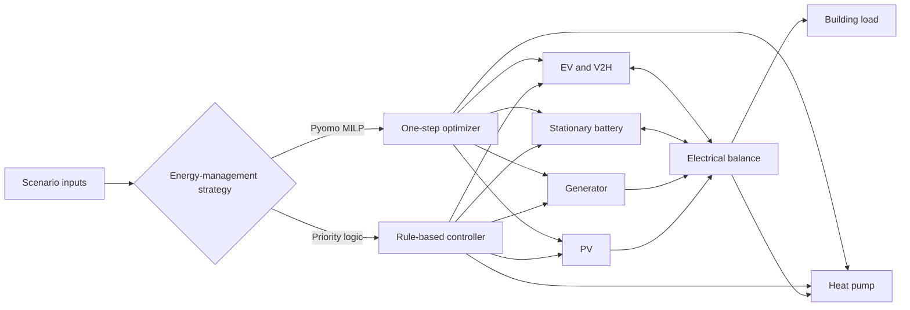

# Rule-Based and Optimization-Based Microgrid Energy Management

A Python study comparing reactive rule-based dispatch with one-step
mixed-integer optimization for a residential microgrid with PV, stationary
battery storage, an electric vehicle, a heat pump and a dispatchable generator.

## Project overview

This DENSYS 2.0 assignment evaluates how two energy-management strategies
coordinate electrical demand, thermal comfort, renewable generation and
flexible storage over four 24-hour scenarios. The rule-based controller follows
an explicit priority sequence. The optimization controller formulates each
control interval as a Pyomo mixed-integer problem with penalties for generator
energy, PV curtailment, temperature deviation, switching/ramping proxies,
battery cycling and EV charging variation.

The repository makes the submitted code easier to inspect and run while
preserving its equations, parameters, objective weights and input datasets.
The simulation has not been rerun during repository preparation; reproduced
and report-only findings are distinguished below.

## Engineering problem

The controller must balance the microgrid while:

- serving the building electrical load;
- maintaining indoor temperature using a heat pump;
- using available PV without exceeding its instantaneous profile;
- keeping stationary-battery and EV state of charge within limits;
- charging the EV to an 80% target before departure;
- allowing vehicle-to-home discharge above the EV target;
- dispatching a generator within its minimum and maximum output limits; and
- avoiding simultaneous charge and discharge decisions in the optimizer.



## Control methods

### Rule-based controller

The rule-based strategy calculates heat-pump demand, determines the minimum EV
charging power needed to meet the departure target, and then branches on PV
surplus or deficit. Surplus PV is allocated to accelerated EV charging and
battery charging. During a deficit, the stationary battery is dispatched
subject to an SOC hysteresis threshold; V2H is then available above the EV
target, followed by generator dispatch.

### Optimization-based controller

For each time step, the Pyomo model selects PV use, generator output,
charge/discharge powers, heat-pump power and binary operating modes. Its
weighted objective is:

```text
min J = generator energy + PV curtailment + temperature-deviation penalty
      + generator switching/ramping penalties + battery-throughput penalty
      + EV charging-variation penalty
```

The implementation is a scalar, receding one-step optimization. Although the
report describes a full-day predictive horizon, the supplied model has no
time-indexed forecast horizon. This difference is material and is documented
in [Known issues and limitations](docs/issues.md).

## System parameters

| Parameter | Value | Unit |
|---|---:|---|
| Simulation interval | 0.025 | h (1.5 min) |
| Samples per scenario | 961 | - |
| Nominal PV power | 10 | kW |
| Generator limits | 2 to 10 | kW |
| Stationary battery capacity | 40 | kWh |
| Stationary battery SOC range | 20 to 85 | % |
| Stationary battery power limit | 10 | kW |
| EV battery capacity | 60 | kWh |
| EV SOC range | 20 to 95 | % |
| EV target SOC | 80 | % |
| EV power limit | 10 | kW |
| Heat-pump power limit | 5 | kW electrical |
| Heat-pump COP | 2.5 | - |

## Repository structure

```text
.
├── data/raw/                 Scenario inputs (S1-S4)
├── docs/                     Audit, methods, workflow and portfolio summary
├── report/                   Publication note for the private team report
├── results/                  Generated plots (ignored except for its guide)
├── src/python/               Controllers, simulator, parameters and utilities
├── tests/                    Static structure and data checks
├── CITATION.cff
├── LICENSE
├── requirements.txt
└── THIRD_PARTY_NOTICES.md
```

See [Repository structure](docs/repository-structure.md) for the complete
source-to-publication mapping and the [complete source inventory](docs/file-inventory.md).

## Installation

Python 3.10 or later is recommended. The source folder contained Python 3.14
bytecode caches, but no environment or pinned dependency versions.

```bash
python -m venv .venv
```

Activate the environment and install the Python dependencies:

```bash
python -m pip install -r requirements.txt
```

The optimization controller also needs a mixed-integer solver:

- Gurobi, with a valid installation and license; or
- GLPK with `glpsol` available on `PATH`.

## Running the controllers

Run commands from the repository root.

Rule-based Scenario 1:

```bash
python src/python/rule_based_controller.py --scenario S1
```

Rule-based all scenarios:

```bash
python src/python/rule_based_controller.py --scenario S1 S2 S3 S4
```

Optimization-based Scenario 1:

```bash
python src/python/optimization_controller.py --scenario S1
```

If no scenario is supplied, the rule-based script preserves its submitted
default of S4, while the optimization script runs S1-S4. Each run prints
constraint checks and an energy summary, then writes a uniquely named PNG to
`results/`.

## Inputs and units

All input files are semicolon-delimited and contain columns `S1` through `S4`.

| File | Quantity | Stored unit | Code transformation |
|---|---|---|---|
| `Load.csv` | Building electrical demand | W | divided by 1000 to kW |
| `PV.csv` | Available PV profile | scaled input | divided by 100 to kW |
| `EV.csv` | EV connection state | 0 or 1 | none |
| `P_loss.csv` | Building-envelope heat loss | kW thermal | none |
| `T_set.csv` | Indoor temperature setpoint | degrees C | none |

The PV source unit before its `/100` scaling is not documented in the supplied
report or code. See the [data dictionary](docs/data-dictionary.md).

## Outputs

Each controller produces time series for:

- PV power used, generator power and heat-pump electrical power in kW;
- stationary-battery and EV power in kW, positive when charging;
- battery and EV SOC in percent for plots and summaries;
- indoor temperature in degrees Celsius; and
- aggregate energy values in kWh.

## Results and evidence status

The input-data energy totals below were independently recalculated from the
published CSV files using the code's scaling and 0.025 h interval. They match
the corresponding load and available-PV values in the report.

| Scenario | Load energy (kWh) | Available PV (kWh) | Reported generator energy (kWh) | Reported final EV SOC |
|---|---:|---:|---:|---:|
| S1 Standard | 19.05 | 26.07 | 9.00 | 80% |
| S2 High PV | 15.94 | 52.15 | 0.00 | 80% |
| S3 Low PV | 12.68 | 8.69 | 50.98 | 80% |
| S4 Tight Window | 21.14 | 52.15 | 17.19 | 80% |

Only the load and PV columns were confirmed directly from the input data.
Generator energy and final EV SOC are transcribed from the report and remain
unverified because the simulations were not executed. The report's table does
not explicitly identify which controller produced those generator values;
its surrounding discussion suggests the rule-based controller.

## Verification status

- The complete seven-page report was read and visually inspected.
- Every Python and CSV source file was inventoried.
- All Python files pass static syntax compilation.
- The five datasets contain 961 rows, four scenarios and no missing values.
- Original source-file hashes were recorded and the source directory was left
  unchanged.
- The control simulations were not executed.
- Gurobi, GLPK, Pyomo and Matplotlib were not available in the audit runtime.

See the detailed [verification report](docs/verification.md).

## Limitations

- The optimization is one-step rather than the report's stated day-ahead
  horizon.
- Solver termination conditions are not checked before solution values are
  used.
- The indoor-temperature state starts at zero in the supplied simulator.
- The plotted time vector ends at 24.025 h rather than 24 h.
- The report and implementation differ in their treatment of heat loss in the
  electrical power balance.
- Input provenance, forecast-error treatment and validation against measured
  operation are not documented.

No numerical formulation was changed while preparing this repository. See
[Known issues and limitations](docs/issues.md) before using the model for
engineering decisions.

## Academic context and contribution

This work was prepared as a three-person DENSYS 2.0 team assignment by Bishnu
Pandey, Md Atiq Aziz and Fadel Muhammed Zikrillah. The supplied files do not
identify each person's individual contribution. Md Atiq Aziz should replace
the contribution placeholder in [the portfolio summary](docs/portfolio.md)
before presenting the project professionally.

## Citation, license and contact

Citation metadata is provided in [`CITATION.cff`](CITATION.cff). Original
repository code and documentation are released under the [MIT License](LICENSE)
where contributor rights permit. Dataset, report and solver notices are in
[`THIRD_PARTY_NOTICES.md`](THIRD_PARTY_NOTICES.md).

Contact: **Md Atiq Aziz** - [add preferred email, LinkedIn and portfolio URL]
