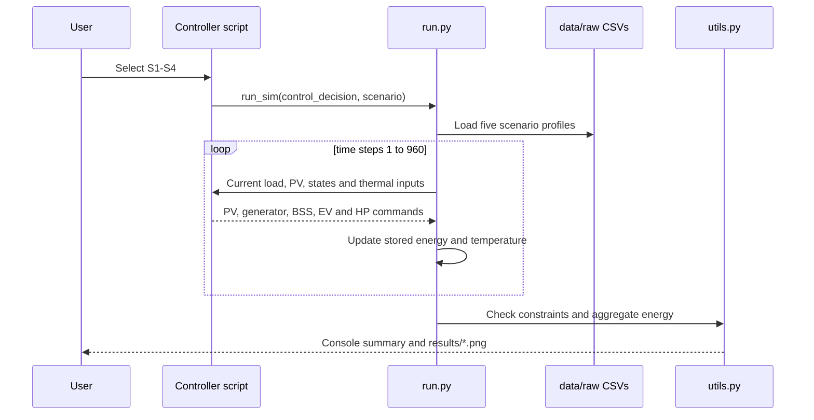

# Code and execution workflow



## Rule-based path

`rule_based_controller.py` evaluates one deterministic decision tree per time
step. It has no external solver dependency.

## Optimization path

`optimization_controller.py` creates a fresh Pyomo model for each scenario.
At each time step it updates mutable parameters, selects the first available
solver from Gurobi and GLPK, solves the one-step MILP, and returns the selected
power commands to `run.py`.

## File dependencies

```text
rule_based_controller.py ------> param.py
           |                         ^
           +------> run.py ----------+
                       |
                       +------> data/raw/*.csv
                       +------> utils.py ------> results/*.png

optimization_controller.py ---> param.py
           |                    Pyomo + Gurobi/GLPK
           +------> run.py
```

## Reproducible commands

```bash
python src/python/rule_based_controller.py --scenario S1 S2 S3 S4
python src/python/optimization_controller.py --scenario S1 S2 S3 S4
python -m unittest discover -s tests -v
```

The final command performs static repository checks only; it does not run the
controllers.
